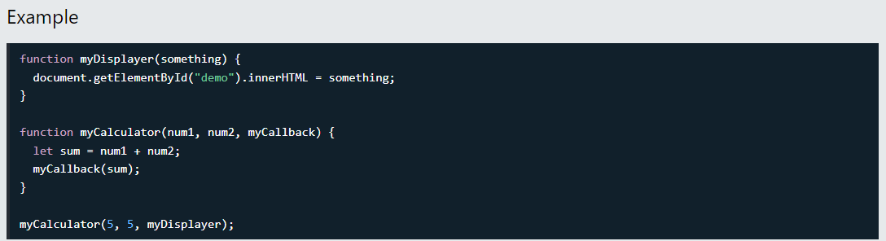
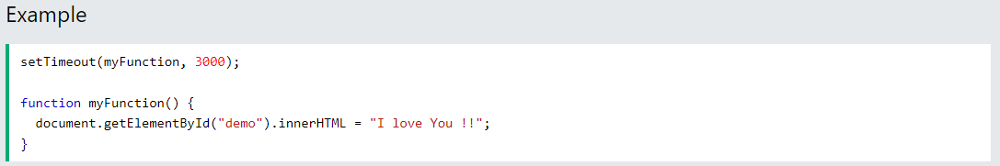
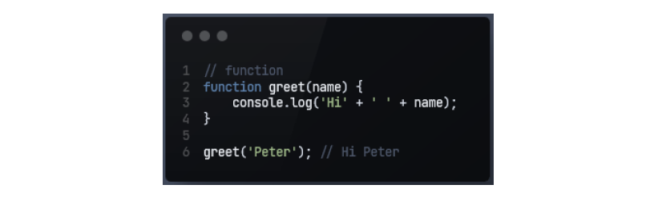
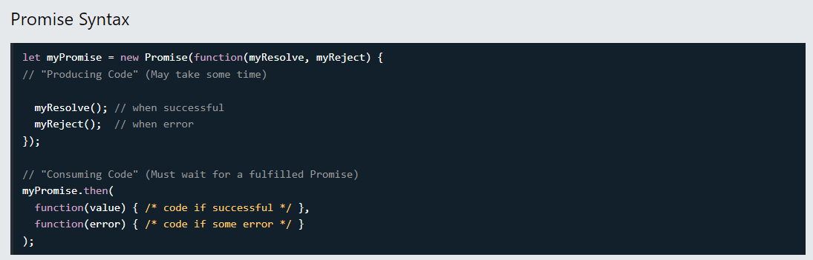

# AsynchSynch
# Synchronous vs Asynchronous
## Asynchronous 
  ### ***Functions running in parallel with other functions are called asynchronous***
  #### Example: *setTimeout*
  
  ****In the example above, *myDisplayer* is the name of a function.****
  It is passed **to myCalculator()** as an argument.
  ## Callbacks are most often used with asynchronous functions.
  ### A typical example is JavaScript *setTimeout()*
  ##### When using the JavaScript function setTimeout(), you can specify a callback function to be executed on time-out:.

  
# Synchronous
### ***Synchronous code runs in sequence. This means that each operation must wait for the previous one tocomplete before executing.***
  # CallBack
  ## A function is a block of code that performs a certain task when called. For example,
  
  ##### *In the above program, a string value is passed as an argument to the greet() function.*
  # Promise 
  ### ***A JavaScript Promise object contains both the producing code and calls to the consuming code***
 
  #### A JavaScript Promise object can be:
  - Pending
  - Fufilled
  - Rejected
 
The Promise object supports two properties: **state and result.**
While a Promise object is "pending" (working), the result is undefined.
When a Promise object is "fulfilled", the result is a value.
When a Promise object is "rejected", the result is an error object.
